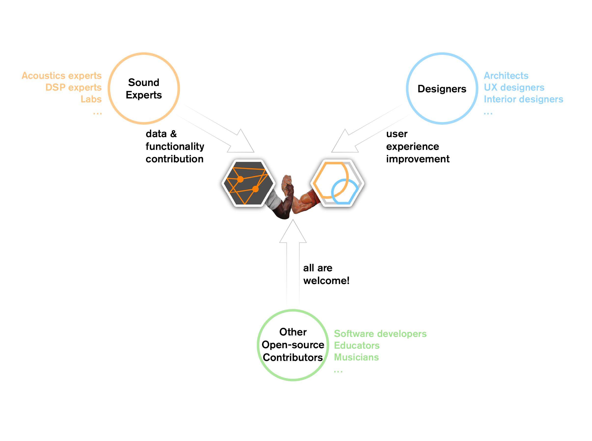

# PyRoomStudio & [PyRoomAcoustics](https://github.com/LCAV/pyroomacoustics) - Contributing

We are always accepting external contributions! We're looking for users who are interested in contributing code (GUI and app functionality) and/or material coefficients (for a public database).

Additionally, this project wouldn't be possible without [PyRoomAcoustics](https://github.com/LCAV/pyroomacoustics), which we use for performing acoustic simulations.
We highly suggest supporting PRA and contributing to them as well. Their updates also help in improving PyRoomStudio!

<p align="center">
  
</p>


## Developing

### Issues

The Issues tab on GitHub contains a running list of features to implement, as well as any bugs or problems that arise from development.


### Development Environment

Environment libraries are provided in `requirements.txt` and consist of minimal tools needed to build the running simulation: PyGame, PyOpenGL, PyRoomAcoustics, and their required libraries.

The easiest way to get started is to create a venv using `pip` with the following:

```
python3 -m venv development_venv
```

After starting your virtual environment, install necessary packages with

```
pip install -r requirements.txt
```

## Materials

We're also looking to expand our project into an open-source database of material coefficients. In the future, we want users to be able to drag-and-drop materials on different surfaces to improve the simulation process. Currently, we're still looking into the best way to store and share such material coefficients- there are several methods scattered around the acoustics and architecture communities. Feel free to send links to existing material databases to Evan or William.
