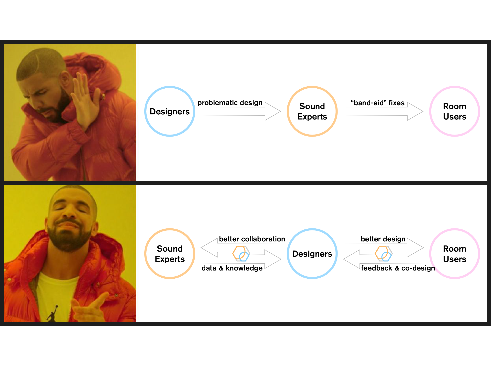

<!-- <p align="center">
  
  <p align="center"><b><font size=32px>PyRoomStudio</font></b></p>
</p> -->

<p align="center">
  
</p>

---
<!------------------------------------------------------------------->

**PyRoomStudio** is an open-source application for rendering and analyzing acoustical properties of 3D spaces via meshes. 
The project acts as a method to graphically use [pyroomacoustics](https://github.com/LCAV/pyroomacoustics), a library for testing and simulating acoustics algorithms written by Robin Scheibler.

> [!NOTE]
> PyRoomStudio is still under significant development- a lot of fundamental features have not been fleshed out yet. Please make a pull request- or contact Evan and William- if you want to contribute to this project.


## **Authors**

William (Zhiwen) Chen (willc@illinois.edu), *Co-Founder & Designer*

Evan M. Matthews (evanmm3@illinois.edu), *Co-Founder & Progammer*


<!------------------------------------------------------------------->

## Mission Statement

PyRoomStudio has two missions:

1. Make room acoustics design accessible and intuitive for designers via open-source software.
2. Connect people passionate about designing for the auditory sense, from both the technical and the creative sides.

By accomplishing these missions, we hope to increase the usage of acoustic tools in the design community and make light of sound as a necessary consideration for future spaces.

<p align="center">
  
</p>


## Setup

1. Clone the repository

    ```
    $ git clone https://github.com/ematth/PyRoomStudio.git
    ```

2. Setup your virtual environment (venv) and install necessary packages

    ```
    $ python3 -m venv venv
    $ source venv/bin/activate
    (venv) $ pip install -r requirements.txt
    ```
3. Open the existing rendering GUI:

    ```
    $ python main_gui.py
    ```

<!------------------------------------------------------------------->

## Controls

- Mouse: **[Left-click]** a surface to enable transparency, **[Right-click]** to set surface color, **[Left-click + hold]** to rotate camera. 

- **[T]**: Set transparency on *all* surfaces of a loaded mesh.

- **[R]**: Reset transparency and color on *all* surfaces.

<!------------------------------------------------------------------->

## Future Plans

- PyRoomStudio's GUI is built with **PyGame**, with rendering done in **PyOpenGL**. This has been feasible for our purposes, but we would like to switch to **PyQT** sometime down the road.

- Current features to be implemented can be found in the Issues tab.


<!------------------------------------------------------------------->


## Credits

- Big thanks to [Robin Scheibler](https://www.robinscheibler.org), Zachary Belanger, [Mohamed Boubekri](https://arch.illinois.edu/people/profiles/mohamed-boubekri), and Paris Smaragdis for providing initial feedback and collaborating with us.

<!------------------------------------------------------------------->

<p align="center">
  
</p>
